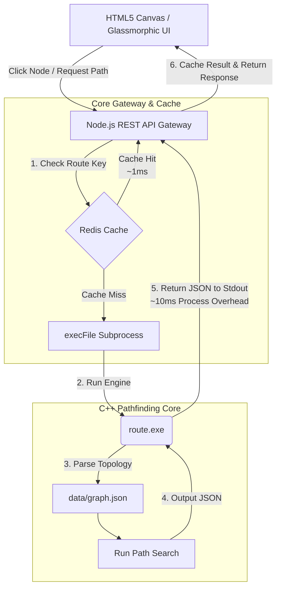

# 🧭 Route & Navigation Pathfinding Visualizer

[](https://isocpp.org/)
[](https://nodejs.org/)
[](https://redis.io/)
[](https://developer.mozilla.org/en-US/docs/Web/API/Canvas_API)
[](https://opensource.org/licenses/MIT)

A high-performance spatial pathfinding visualizer combining an optimized **C++17 pathfinding core**, a **Node.js REST API gateway**, a **Redis caching layer**, and an interactive glassmorphic **HTML5 Canvas frontend**.

This system calculates shortest paths across complex geographic networks with sub-microsecond algorithmic latency, utilizing a hybrid design that keeps heavy computations close to the hardware.

---

## 🏗️ Architecture Design & Performance Strategy



### ⚡ The Subprocess Caching Strategy
* **The Challenge**: Spawning compiled C++ binary processes (`execFile`) from Node.js introduces **operating system process creation overhead (approx. 5ms to 15ms)**, even though the core C++ search algorithm finishes in less than **2 microseconds**.
* **The Solution**: By introducing **Redis caching** (`TTL = 1 hour`) with a cache key format `route:<start>:<end>:<algorithm>`, repeat queries bypass the OS process creation latency.
* **The Impact**: Under cache hits, API response latency is reduced from **~15ms to < 1.5ms (a ~10x speedup)**.

---

## 📐 Pathfinding Algorithms Reference

The engine implements four search algorithms, compiled in the C++ core:

| Algorithm | Type | Complexity (Time) | Complexity (Space) | Path Optimality | Heuristic Definition |
|:---|:---|:---|:---|:---|:---|
| **A\* Search** | Weighted | $O(E \log V)$ | $O(V)$ | **Optimal** | Euclidean Distance ($h(n) = \sqrt{\Delta x^2 + \Delta y^2}$) |
| **Dijkstra** | Weighted | $O(E \log V)$ | $O(V)$ | **Optimal** | None ($h(n) = 0$) |
| **BFS** | Unweighted | $O(V + E)$ | $O(V)$ | **Fewest Edges (Hops)** | None (FIFO queue exploration) |
| **DFS** | Unweighted | $O(V + E)$ | $O(V)$ | **Non-Optimal** | None (LIFO recursive backtracking) |

*Legend: $V$ = Number of vertices/nodes, $E$ = Number of edges/connections.*

---

## 📖 API Documentation

The Node.js gateway serves static files and exposes two main REST endpoints:

### 1. GET `/graph`
Reads the active network topology from the filesystem and returns node coordinates and edge weights.
* **Response Status**: `200 OK`
* **Response Payload**:
  ```json
  {
    "nodes": [
      { "id": 0, "x": 1.5, "y": 2.0 },
      { "id": 1, "x": 4.0, "y": 6.5 }
    ],
    "edges": [
      { "from": 0, "to": 1, "weight": 5 }
    ]
  }
  ```

### 2. POST `/route`
Computes the shortest path between a starting node and destination node using the selected pathfinding algorithm.
* **Request Payload**:
  ```json
  {
    "start": 0,
    "end": 19,
    "algo": "astar"
  }
  ```
* **Response Status**: `200 OK`
* **Response Payload (Cache Miss / First Run)**:
  ```json
  {
    "path": [0, 1, 5, 6, 11, 12, 19],
    "time_us": 1.637,
    "cache": "MISS"
  }
  ```
* **Response Payload (Cache Hit / Subsequent Runs)**:
  ```json
  {
    "path": [0, 1, 5, 6, 11, 12, 19],
    "time_us": 1.637,
    "cache": "HIT"
  }
  ```

---

## 🛠️ Local Installation & Launch

### Prerequisites
* G++ compiler supporting **C++17** standard library.
* **Node.js** (v16 or higher).
* **Redis Server** (listening on localhost port 6379).

### Step 1: Clone and Set Up C++ Routing Core
Compile the C++ source files into an optimized production binary (`route.exe` / `route`):
```powershell
# Navigate to the core source
cd core/src

# Compile using G++ with level 3 optimization flags
g++ -O3 -std=c++17 main.cpp graph.cpp dijkstra.cpp astar.cpp bfs.cpp dfs.cpp -o route.exe
```

### Step 2: Start Redis Server
Ensure your local Redis server is up and listening on port `6379`. (On Windows, Memurai or WSL Redis can be used).

### Step 3: Launch Node.js API Gateway
1. Navigate to the api directory:
   ```powershell
   cd ../../api
   ```
2. Install npm dependencies (Express, Redis client):
   ```powershell
   npm install
   ```
3. Run the gateway server:
   ```powershell
   node src/server.js
   ```
The gateway will start on **`http://localhost:3000`** and log: `Redis connected`.

### Step 4: Access Visualizer Dashboard
Open your web browser and navigate to: **[http://localhost:3000](http://localhost:3000)**.
* Click on nodes directly in the HTML5 Canvas to select start/destination coordinates.
* Toggle algorithms in the glassmorphic sidebar controller.
* Press **Find Route** to launch pathfinding calculations.

---

## 🗺️ Customizing graph topology
You can dynamically edit the network graph by modifying the JSON configuration:
* **File Path**: `data/graph.json`

### 1. Nodes Coordinates
Assign sequential IDs (starting at 0) and float mapping coordinates:
```json
{ "id": 5, "x": 4.5, "y": 3.0 }
```
*Note: The frontend Canvas automatically calculates boundary offsets and scales coordinates dynamically to center the graph layout.*

### 2. Edges and Weight
Define bidirectional connection links and node-to-node path costs:
```json
{ "from": 4, "to": 5, "weight": 3 }
```
*(Reverse connection links are handled and parsed automatically by the C++ engine loader).*

---

## 👨‍💻 Author & Connect

**Shivansh Nigam**
* **Email**: [s2704nigam@gmail.com](mailto:s2704nigam@gmail.com)
* **GitHub**: [shivanshh27](https://github.com/shivanshh27)
* **LinkedIn**: [shivanshh27](https://linkedin.com/in/shivanshh27)

Feel free to connect or reach out for discussions regarding spatial algorithms, caching topologies, or high-performance systems!

---

## 📄 License
This project is licensed under the MIT License - see the [LICENSE](LICENSE) file for details.
